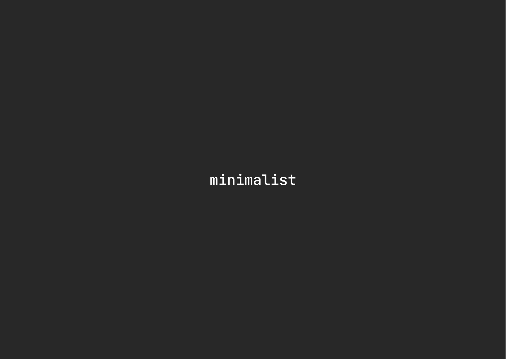

### Hi there 👋, Arvind Choudhary
#### I am a front-end developer

I made this project just for fun, it allows you to create nice and simple GitHub Readme files that you can copy/paste and use in your profile.

Skills: ANGULAR / REACT / TS / JS / HTML / CSS

- 🌱 I’m currently learning backend technologies and about open source projects. 
- 📫 How to reach me: arvindchoudhary.in.connect@gmail.com 
- ⚡ Random : I like nvim, cli tools & anything terminal. 

      

