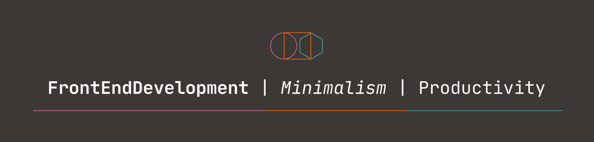

### Hi there,  Arvind Choudhary
## I am a front-end developer

---
Looking to contribute to open source projects.

Skills: ANGULAR / REACT / TS / JS / HTML / CSS / mongoDB / 
        sometimes python

- 🌱 I’m currently learning backend part ( node.js | redux ( state management ) etc )  and about source projects. 
- 📫 How to reach me: arvindchoudhary.in.connect@gmail.com 
- ⚡ Random : I like nvim, cli tools & anything terminal. 

Contact 

- [linkedin](https://www.linkedin.com/in/arvind-choudhary-bb036b244?lipi=urn%3Ali%3Apage%3Ad_flagship3_profile_view_base_contact_details%3B0PQVZANnSWCDhAh23w3Spg%3D%3D)

- arvindchoudhary.in.connect.@gmail.com

